# Music To My Ears

Here is a link to the live project. (https://music-to-my-ears-nka.herokuapp.com/)

This website was created for Milestone 4 

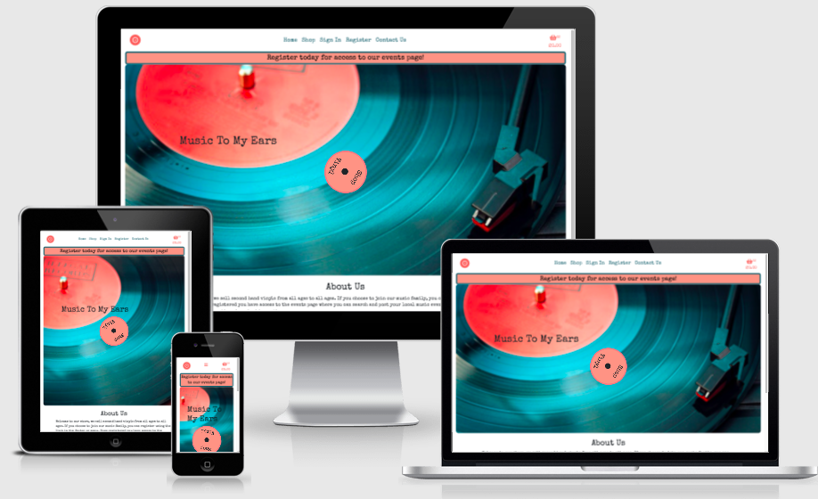

## Contents 

- [User Experience (UX)](#user-experience-ux)
   * [Strategy](#strategy)
   * [User Stories](#user-stories) 
   * [Scope](#scope)
      + [Current Features](#current-features)
      + [Features to implement in the future](#features-to-implement-in-the-future)
   * [Structure](#structure)
   * [Skeleton](#skeleton)
   * [Surface](#surface)
     + [Colour Scheme](#colour-scheme)
     + [Typography](#typography)
     + [Imagery](#imagery)
- [Technologies](#technologies)
   * [Languages used](#languages-used)
   * [Frameworks, Libraries & Programs Used](#frameworks-libraries-and-programs-used)

- [Challenges](#challenges)

- [Testing](#testing)
   
- [Deployment](#deployment)
   * [Creation](#creation)
   * [Forking](#forking)
   * [Clone](#clone)
   * [Setting up AWS](#setting-up-aws)
   * [Setting Up Stripe](#setting-up-stripe)
   * [Setting Up Project](#setting-up-project)
   * [Heroku Deployment](#heroku-deployment)

- [Credits](#credits)
   * [Code](#code)
   * [Content](#content)
   * [Media](#media)
   * [Acknowledgements](#acknowledgements)

## User Experience (UX)

   ### Strategy 
   - User goals 
     * As a user I want to be able to by Vinyls.
     * As a user I want an attractive easy to use site.

   - Site owner/ business goals
     * As the site owner I want my site to be responsive to different screen sizes.
     * As the site owner I want my site to be accessible to my visitors.
     * As the site owner I want to build up media presence, to ultimately build up customers.

   ### User Stories

   - #### Unregistered Visitor
        1. As an unregistered visitor, I want to be able to add products to my cart
        2. As an unregistered visitor, I want to be able to view my cart
        3. As an unregistered visitor, I want to be able to edit my cart
        4. As an unregistered visitor, I want to be able to checkout
        5. As an unregistered visitor, I want to see an order confirmation
        6. As an unregistered visitor, I expect the site to look good on my mobile device.
        7. As an unregistered visitor, I want to easily search the vinyls.

   - #### First Time Visitor (in addition to above)
        1. As a first time visitor, I want to easily understand the main purpose of the site.
        2. As a first time visitor, I want to be able to intuitively use the site.
        3. As a first time visitor, I expect to see an attractive, visually appealing site.
        4. As a first time visitor, I expect an accessible site.
        5. As a first time visitor, I expect the site to look good on my mobile device.
        6. As a first time visitor, I want to easily register.

   - #### Registered Returning Visitor Goals
        1. As a returning visitor, I want to be able to view and add to the event board.
        2. As a returning visitor, I want to follow on social media so I can hear of any new products.
        3. As a returning visitor, I want to be able to change my password.
        4. As a returning visitor, I want to be able to save my details
        5. As a returning visitor, I want to get feedback so I know that something has went through.
      
   - #### Registered Frequent Visitor Goals
        1. As a frequent visitor, I want to be able to edit an event I’ve added to the event board.
        2. As a frequent visitor, I want to be able to contact the owner.
        3. As a frequent visitor, I want to be able to edit my profile information.
        4. As a frequent visitor, I want to be able to delete my account
        5. As a frequent visitor, I want to be able to see my order history
        6. As a frequent visitor, I don't want to have never ending scrolling up or down.
        7. As a frequent visitor, I want to be able to search for events.

   - #### Superuser goals
        1. As superuser, I want to be able to add, delete or edit a product.
        2. As superuser, I want to be able to add a genre.
        3. As superuser, I want to be able to delete or edit an event on the event board
        4. As superuser, I want to be able to delete a user.
        5. As superuser, I want to be able to make another user an admin.
        6. As superuser, I don’t want users to be able to order product if there is none left in stock.

   ### Scope

   Within project conception, a list of features were compiled, these were the scored 
   between 1 & 5 for importance and feasibility/ viability which then decided which features 
   could be included for initial launch.    

   #### Current features 

-   Responsive on all device sizes

-   Accessible 

-   Easy to navigate (Single use learning)

-   Interactive elements

-   Social Links 

-   Ability to contact owner via contact page.

-   Contact form prefills the personal information for logged in users.

-   Changing nav menu and footer links and buttons in depending on the users log in status, admin status and what event if any they have added.

-   Able to search products for song, artist or album name.

-   Can search events for name of event, location or details.

-   'Back to top' footer link on each page, saves users from having to scroll up to Nav bar especially on mobile devices.

-   Logged in users can add events to event board.

-   Logged in user can save their addresses and default address, pre-fills Checkout form

-   User can edit events on event board that they themselves added. 

-   User can edit their own profile information

-   Admin users can add, edit and delete any products.

-   Admin user can add, edit and delete any event.

-   When product stock quantity is 0, add to cart buttons are not available and will display 'Out of Stock'.

-   Before anything is deleted a confirmation is required preventing accidental deletion.

-   Cancel buttons on edit pages in case user changed their mind or got there accidentally.

-   Confirmation email on registration and on successful purchase.

   #### Features to implement in the future

- To be able to select one of their saved addresses to prefill the checkout form. I knew I wanted user to be able to save multiple addresses incase sending as a gift etc, so I've started the groundwork. But generally users billing and delivery addresses are the same and thats what they'll mostly use and so not a priority for initial launch.
- To be able to change Vinyl default image from frontend rather than having to go into admin panel. Decided this wasn't a priority as more often than not the default image would be the front of the record so you really wouldn't want to change it unless you accidentally uploaded the wrong image but thats why I added the image previews for file input fields.
- Would like to add customer reviews of vinyls and of the site.

### Structure

-   Created a database schema using [GraphizOnline](https://dreampuf.github.io/GraphvizOnline/), as per Emmets     instructions on [slack](https://code-institute-room.slack.com/archives/C7HS3U3AP/p1642276160282900) see [here](/docs/readme_assets/readme-images/db-schema.png) to view better.

     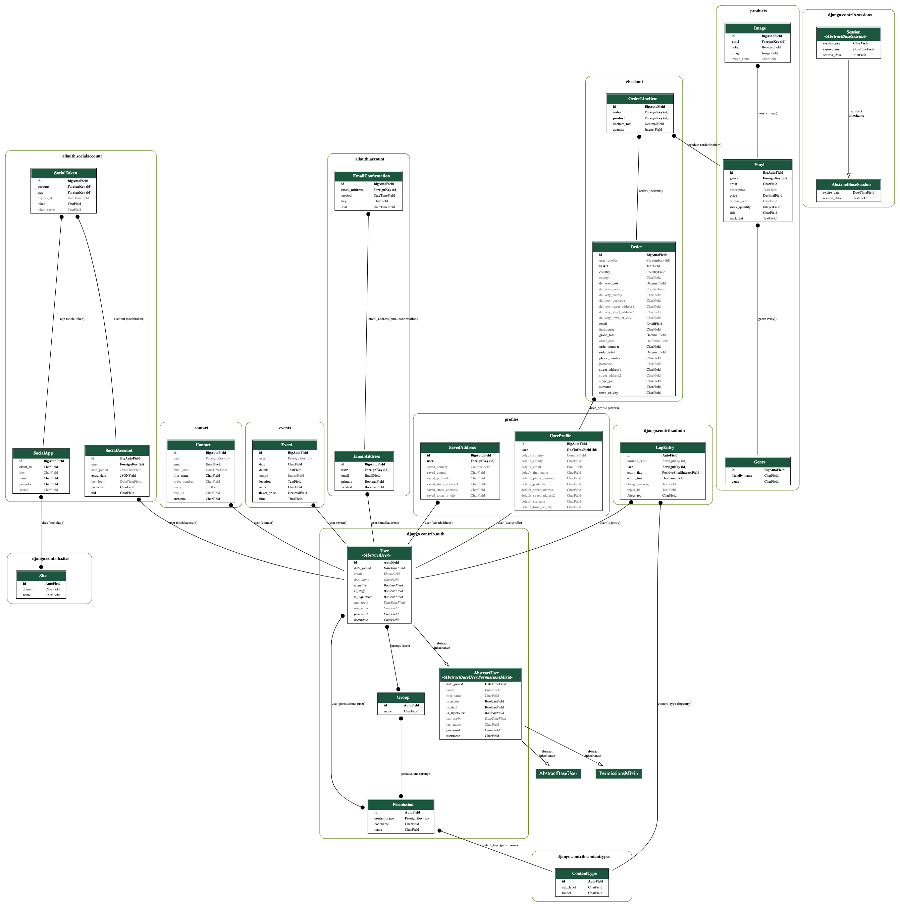

### Skeleton 

Wireframes were created on Balsamiq (see links below)

* [Mobile](/static/readme_assets/wireframes/ms4-mobile.pdf)
* [Tablet](/static/readme_assets/wireframes/ms4-tablet.pdf)
* [Desktop](/static/readme_assets/wireframes/ms4-desktop.pdf)

### Surface

 -  #### Colour Scheme
    
    Picked these colors from the landing page image using the colour picker from Chrome devtools. These colours create set the feel of the site, the teal is modern and trendy but the peach offsets that with a warm and welcoming accent. 
    
    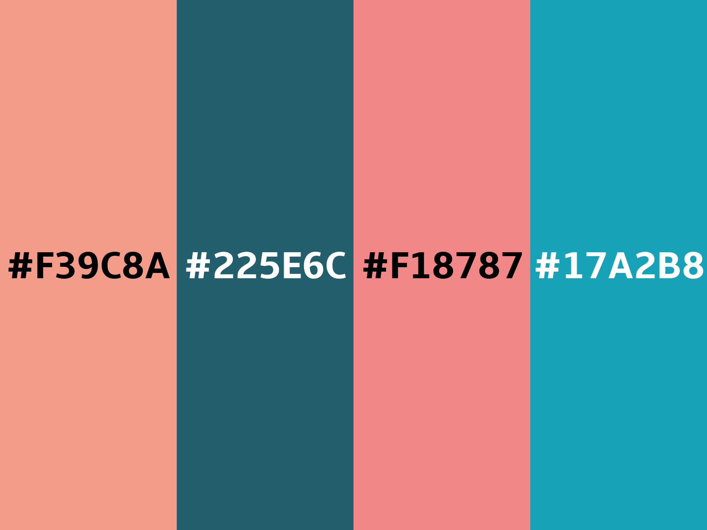
        
-   #### Typography
         
    Used [Google Fonts](https://fonts.google.com/) to import the fonts used for this site.
    Picked Special Elite as it was reminiscent of the font used for the tracklist found on old vinyl record labels.
      
-   #### Imagery

    The images I've used on the top of each page were picked to create the feel and atmosphere of an old school music shop where you could leisurely peruse the music and pick out your next favourite band. The image for account pages are the same, as are those to do with the shop and products. The event and contact share another image.
    
## Technologies 

### Languages Used

-   [HTML5](https://en.wikipedia.org/wiki/HTML5)
-   [CSS3](https://en.wikipedia.org/wiki/Cascading_Style_Sheets)
-   [JavaScript](https://en.wikipedia.org/wiki/JavaScript)
-   [Python](https://en.wikipedia.org/wiki/Python_(programming_language))

### Frameworks, Libraries and Programs Used

1. [Bootstrap v4.6.0](https://getbootstrap.com/docs/4.6.0/getting-started/introduction/)
    - Bootstrap was used for the initial layout and styling before customising it.
2. [Google Fonts](https://fonts.google.com/)
    - Google fonts were used to import the Tangerine and Gentium Book Basic. 
3. [Font Awesome](https://fontawesome.com/)
    - The icons used throughout.
4. [Git](https://git-scm.com/)
    - Version control.
5. [GitHub](https://github.com/)
    - For storing project.
6. [Gitpod](https://www.gitpod.io/)
    - Used for editing my code.
7. [Balsamiq](https://balsamiq.com/)
    - Wireframe creation
8. [TinyJPG](https://tinyjpg.com/)
    - TinyJPG was used to optimise the images I used on my site to minimise loading time.
9. [Am I responsive](http://ami.responsivedesign.is/)
    - This was used to generate the image at the top of this README.
10. [Chrome devtools](https://developer.chrome.com/docs/devtools/)
    - This was used massively throughout development to troubleshoot, try out changes before 
   changing code, to test responsiveness and for testing performance of the final site with lighthouse. 
11. [jQuery](https://jquery.com/)
    - Required for some of the bootstrap elements such as collapsibles, modal and tooltips.
12. [Heroku](https://dashboard.heroku.com/apps)
    - For deploying the application
13. [Postgres](https://www.postgresql.org/)
    - Database used for our data
14. [Django](https://www.djangoproject.com/)
    - Framework for building applications.
15. [Stripe](https://stripe.com/gb)
    - Used for our online payment system
16. [Django Secret Key Generator](https://miniwebtool.com/django-secret-key-generator/)
    - Used to generate secret key
17. [GraphizOnline](https://dreampuf.github.io/GraphvizOnline/)
    - Used to create the database schema.
18. [convertingcolors.com](https://convertingcolors.com/color-bucket.html)
    - For making my colour palette picture
19. [AWS](https://aws.amazon.com/)
    - For hosting the static and media files required by the project.

## Challenges 
   These are aspects of the development that took me a while to figure out due to inexperience.
   - Changing product models after I'd initially migrated. I added more fields to two of my models, migrated and it didn't seem to register that this change had happened.  
       + Solution: Deleted the added fields migrated and then added them again and remigrated   
   - Getting logic to work for only showing add to basket button if not in basket or quantity in basket was less than quantity available. Tried loads of different things including template tags.
       + Solution: Got the infomration in views and passed in to template in context.
   - Blockpostload js with strip info and script with stripe_elements.js file, kept getting an error like I hadn't put in the appropriate block tags. 
      + Solution: Had forgotten to load static at top of template, karthikr on stack overflow https://stackoverflow.com/questions/22650371/django-is-it-impossible-to-static-tag-into-block-tag   
   - Tried to do different elements for stripe to render the input fields rather than just the card element but then it got a bit confusing when it came to payment method, felt I wasn't going to have all the checks that happen in the card element automatically so reverted back.
   - Had been added in a few things after the intial webhook check and now the checkout button wasn't doing anything, deleted everything and started adding them back in one by one, fadeToggle on loading overlay and payment form wasn't working so changed to hide and show and then opposite in case of form error. Next I added back in the billing and shipping to pass into stripe, that was also breaking it, realised it was looking for full_name in form where mine was split into first_name and surname.
      + Solution: Passed in both my fields together to supply full name 
   - My delivery address wasn't appearing in my order and therefore wasn't diplaying in my template. Realised because I'd created two forms one OrderForm and the other DeliveryForm, order was only being created with the OrderForm data. Tried adding in the OrderForm but couldn't figure out how to pass in that data as the delivery_data so just had to do it individually. Will go back to it if I have time and try to do it in a more efficient way.
   - When writing stripe_elements.js it came to the stage of wrapping my confirm payment code within a .post method to send data to the cache_checkout_data function. This broke my site and the loading spinner just kept going around and around. Checked the variables that I was passing in, the url, the cache_checkout_data, looked at boutique ado's source code to make sure that I wasn't missing anything. Checked settings and my github variables. All were correct. Put a print statement inside cache_checkout_data and it never printed so my data wasn't getting there. So knew is was coming from the single line '$.post(url, postData).done(function (){'. After two nights trying to fix this, Dave Horrocks jumped on a call with me and together we went through everything and after half an hour we thought lets check the jquery version as I'd already had the issue with fadeToggle so maybe .done was also the culprit. Changed my https://cdnjs.cloudflare.com/ajax/libs/jquery/3.5.1/jquery.slim.min.js to boutique ado's https://code.jquery.com/jquery-3.4.1.min.js and it worked. So stuck with that incase of anything else being affected down the line.
      + Solution: Changed jquery version 
   - Webhooks kept failing. When getting the information from the webhook I'd used my names and not theres, e.g county instead of state, town_or_city instead of just city etc.
      + Solution: Update to stripes field names to extract data from webhook 
   - While checking my add_product functionality the new product wasn't displaying. Spent ages checking the logic and the image file and if it had saved correctly. Realised that if i put in a 
 in the  that would print out but still the carousel didn't appear and the carousel that had been working disappeared. So looked at my carousel code and the divs and closing tags etc. Finally twigged it was my carousels js to add 'active' class to the first carousel-item so that they display one at a time. This was only being applied to the first child of the first element with class carousel-inner rather than all first children of those elements with carousel-inner class.
      + Solution: Re-do the javascript to target all the first children of each carousel-inner. 
   - Could not get the confirmation email to work from contact page, checked my code against boutique and checked the django docs. Tried sending it without the text files and it worked but the formatting was horrible. The error i was getting was couldn't find template, which i was confused about as I wasn't counting a text file as a template but the names of the files matched. Eventually realised that my confirmation_emails folder was in templates folder but not actually inside the contact folder within that.
      + Solution: Moved file to the correct location. 
   - In my previous project I put rating stars in my contact form so wanted to do the same but with vinyls instead of stars. As the form is rendered by django I was struggling to acheive this by css. I then realised I would have to do it with js, changing the html to the icon when page loads. This worked but wanted 2 vinyl for a rating of 2 etc so it took me an age trying loops etc to repeat the html code per number required. 
      + Solution: Used $(this).html(html.repeat(index)) 
   - User wasn't being assigned to events. Only realised this when I created a non superuser account and account couldn't edit events that I had just added with that account. Looked on admin panel and realised than only those that I created in the user panel had got a user and similarly same with contact records. So turns out in contact I had contact.user = users record rather than just request.user and in add_event I hadn't done instance = form.save(commit=False) and then instance.user, I was just doing form.user. So between them I had the right code.
   - After deploying and setting up AWS, I started to add genres and products and their images to the new database. Individually as didn't create a dataset just a couple in development to ensure code was working. I noticed that none of my images were appearing. I thought it was to do with my src attributes still saying /media/ and so i changed them to {{ MEDIA_URL }} in development which i had in my settings.py. This then broke it and i now wasn't seeing the images in development either. I googled how to see settings.py variables from within a template and it said I needed a context processor. Went back to boutique ado source code and yeah i'd missed the 'django.template.context_processors.media'.
     + Solution: Add context processor to settings.py 
   - Webhooks were by far the worst. Had them all set up and in stripe were succeeding. Then when I was adding a new endpoint for the deployed site realised that all my webhooks had been failing for over a week! Noticed that I had added code to my webhandler around that time so commented it out and still nothing. While googling I seen something about having too much of a time delay if your logic is quite long so in webhooks.py took out code and added in to just send the httpresponse straight away, this still failed. Added in print statements in a few places to try figure out where it was failing. None of these printed so it seemed that my app wasn't listening for the webhooks or it wasn't getting them. I wasn't getting any error codes which didn't help. With my deployed site I also wasn't getting any successful webhooks. Checked my urls.py, secret_keys etc, checked that at the end of my endpoints I had /checkout/wh/. Had missed the / off my new endpoint and found that 'user' wasn't defined in my webhook_handler file, so imported User and still not working. Had been googling and searching on slack & trying things for hours so gave up for the night. The next morning I remembered seeing a post by Igor but it hadn't come up in my search the night before and I couldn't remember what channel but I eventually found it on the dev-tips channel about troubleshooting webhooks. It explained that github sometimes changes the workspace urls and so my endpoint had changed. Fixed that, but at the same time wondering how that was going to fix my new webhook as it was only created the day before and therefore wouldn't be the same issue. Checked the new webhook and it was miraculously now allowing webhooks but still have failures for payment suceeded webhooks. Working in development webhook again, webhooks were still failing but I was now getting 500 errors these were all easy fixes like calling the field 'address_field_line1' but because it was from webhook it should have been address.line.1, my confirmation_emails folder was in the same level as checkout not within it. Finding UserProfile was not right either. It was a cacophony of mistakes and I must have resent the webhook about 15 times but finally I got that green tick in webhooks.
     + Solution: Endpoint url had changed. 
   -  Events not working in deployed site, was thinking its because I was passing in events but hadn't assigned it as None if there  wasn't any, checked my urls etc aswell although as it was working in development didn't think that was it. That didn't fix it, went into admin to try and add an event and see if there was an event if that would work and that would narow down the search for the issue. That also didn't work. Found a stackoverflow with same error and solution was to migrate. I was sure I'd done this but i did it and it worked eventually as I was pasting in the database url into settings without the "" for ages and wondering why it wasn't working.
   - None keeps getting added to saved addresses when the optional delivery address isn't completed. I was getting any save_address_data from form and then if save_address_data create instance in database. So I tried if not Null and looked for empty fields etc, eventually got round to: if save_address_data.get('saved_street_address1') which worked.
   - While working on events page, it kept letting me add events that already existed, when I had used iexact to ensure that would't happen. I wasn't getting the value from the form properly so wasn't matching.
     + Solution: Clean form data. 
   - Carousel stopped working, and the edit and delete links in basket stopped working too. At the same time noticed in admin that the genres of the products said self.genre. One of the issues was in my attempt to get rid of pylint errors for __str__ does not return a string, I had in my wisdom put return "self.genre" and so I changed them all back. The carousel id's I changed from {genre} to {genre.genre} and that seemed to get them working again. The basket links not working seemed to only be for some products, specifically those with longer titles. Aretha Now for example worked but Sinatra's sinatra and 20 Golden Greats did not. Changed the id's to product_id which didn't work.
    + Solution: ID's should only contain numbers, letters and underscores and should not start with a number. So changed id's to "prod_{{ item.product_id }}_edit" 

## Testing

Testing and results can be found [here](TESTING.md)

## Deployment

 - ### Creation 

    I created this repository by: 
    (a) Logging into Github and clicked the green new button. 
    (b) This took me to the page below. I selected the code institute template, input a repository name and clicked the green create repository button. 

    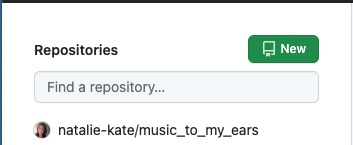
    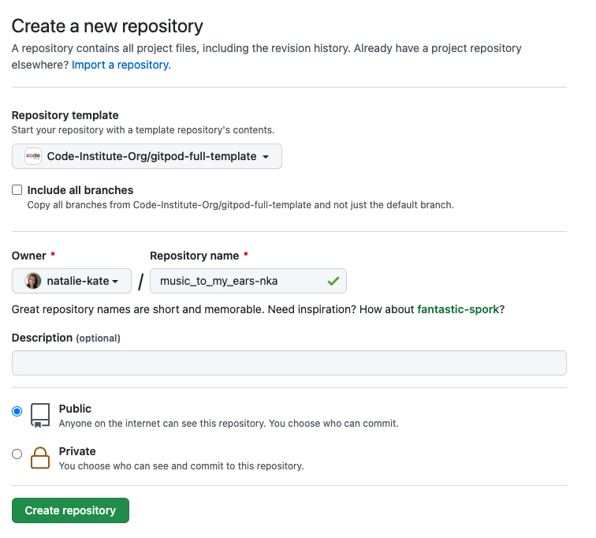

    (c) Opened new repository and clicked green Gitpod button to create a workspace in Gitpod for editing.

  - ### Forking
    (a) To fork my project sign in to Github and go to my [repository](https://github.com/natalie-kate/music_to_my_ears) 
    (b) Above and to the right of the settings there are three options and the far right one says Fork, select this. 
    (c) The fork is now in your repositories.

    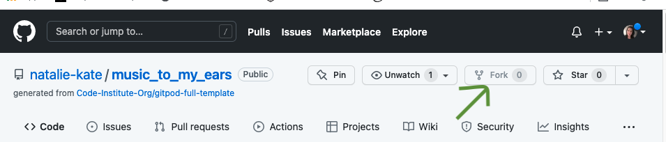

  - ### Clone
    To clone my project sign in to Github and go to my [repository](https://github.com/natalie-kate/music_to_my_ears) 
    See [Setting up AWS](#setting-up-aws), [Setting Up Stripe](#setting-up-stripe), [Setting Up Project](#setting-up-app)
    and [Heroku Deployment](#heroku-deploment) for more information about what will be required to run Music to my ears.

    *  Clone using command line 
        +  Next to the green Gitpod button is a button that says code, select this. There is a few options as to how you 
        would like to clone, if you choose https, SSH or Github CLI, select the clipboard icon to copy the URL.
        +  In your workspace that you've created, in the terminal , type git clone, paste the URL and enter.

        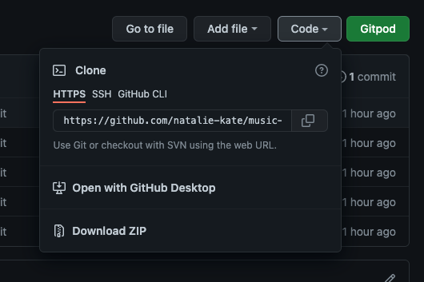

    *  Desktop Github
        + If you choose to clone by selecting open with desktop Github, it will guide you through the clone with prompts. 

    For more information or troubleshooting see the Github documentation 
    [here](https://docs.github.com/en/github/creating-cloning-and-archiving-repositories/cloning-a-repository#about-cloning-a-repository)

- ### Setting Up Project
   
    - Install requirements in terminal using pip3 install, see requirements below. If you have cloned my project you can use   pip3 install -r requirements.txt which will install everything for you.
    
      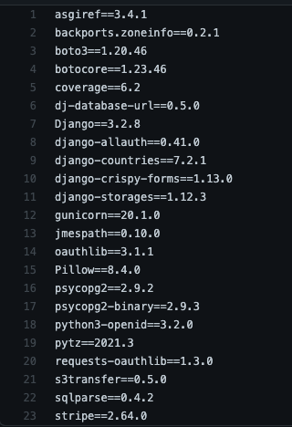

    - Create a SECRET_KEY for django to use. I used [Django Secret Key Generator](https://miniwebtool.com/django-secret-key-generator/) for this. My settings.py file is set up to collect keys from the environment so name your variables accordingly. In github you go into settings from your dashboard and then variables. And add the following. You can complete the rest when you go through these sections. DEVELOPMENT value is set to True. Scope you can set to your repository name meaning its only accessible by that project or you can set it to */* meaning all your repositories can access them. 

        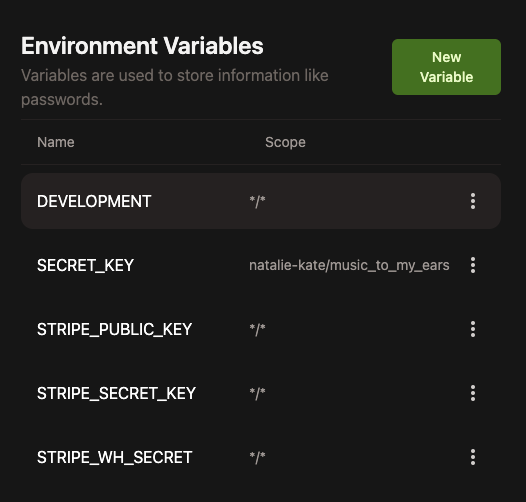

    - Ensure you have requirements.txt file and Procfile. These are required by Heroku so ensure these are pushed to github prior to deployment. Ensure all requirements are saved by using pip3 freeze > requirements.txt

    - If using in development you will need to Run migrations usimg command python3 manage.py makemigrations and then python3 manage.py migrate. To create a superuser in the terminal to get access to admin panel, use command python3 manage.py createsuperuser and fill in details required.

- ### Setting up AWS
    - Register with AWS [here](https://aws.amazon.com/) if you don't already have an account, I'm just using the free tier. In AWS managment console, use the search box to find S3. Once selected click Create Bucket button, this will open a form, name your bucket and choose region nearest you, unselect block all public access checkbox and then Create Bucket.

        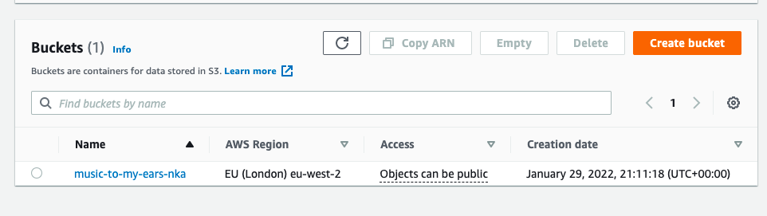
        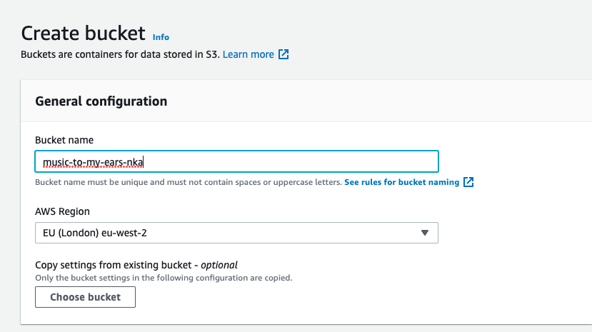

    - Now in new bucket select Properties tab, scroll down to Static Website Hosting, click edit, select enable and down at index page, fill in index.html, this won't be used by us but its required by the bucket.

        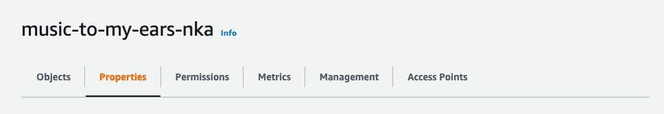
        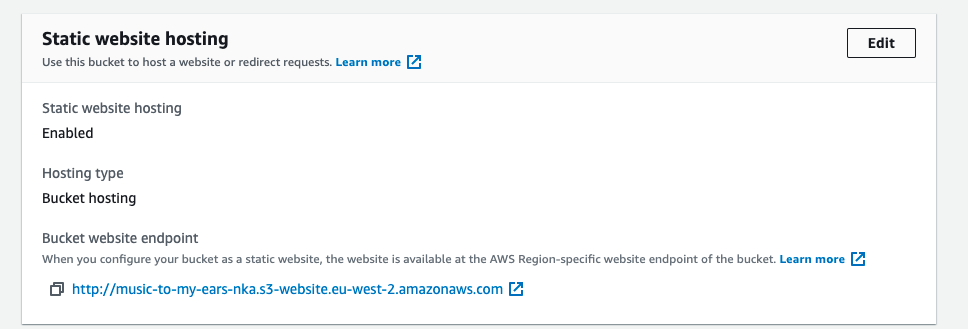

    - Now in Permissions from the bucket menu, scroll down to CORS section and paste in below.

        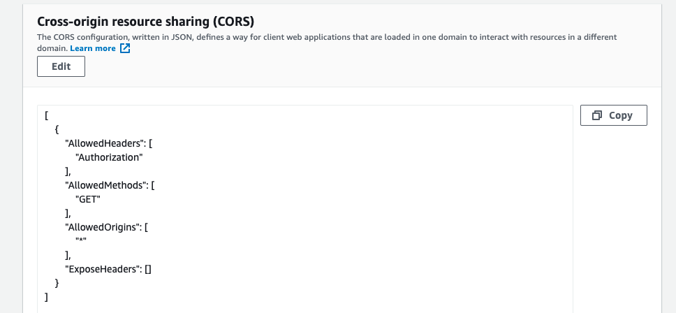
    
    - Still in permsssion select edit in bucket policy, then select Policy generator, fill in the following settings: Type- S3 Bucket Policy, Effect- Allow, Principal- *, AWS Service- Amazon S3, Actions- Get Object, Amazon Resource Name- paste in ARN number see example below.

        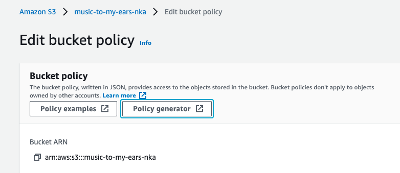

    - We now need to create a user to access the bucket. Using search box again search for IAM. Now in IAM select User Groups from menu, Create User Group, give it a name and Create Group.

        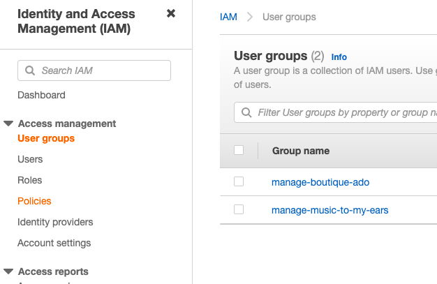
    
    - Back in the menu select Policies, create Policy, then in json tab click Import Managed Policy link and select Amazon S3 Full Access. We want to edit the Resource section of it, so grab the ARN from your bucket and paste it in, and then again but with /* on the end, see example below. Now we can click next until we get to Revie policy page and give it a name and description and Create Policy.

        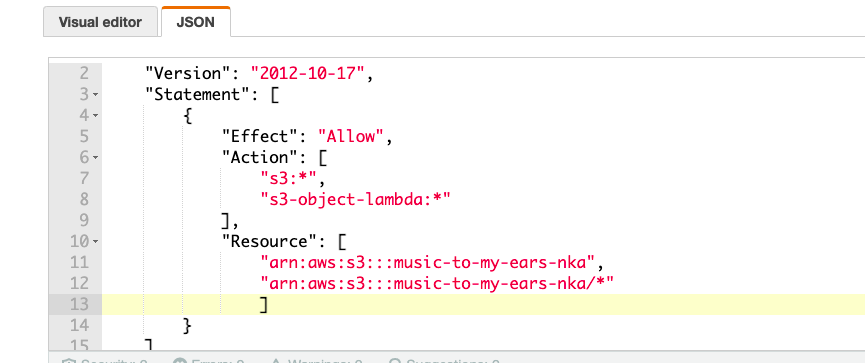

    - In the User Group we just created , click Permissions and we can now attach the policy we just created
    - Back in the IAM menu, select Users, add user, fill in a name, select Access Key- Programmatic Access, click Next. Add user to your new group by selecting it, Next and Create User. We now want to download and save our CSV file as this contains the keys we need and once you leave this page you can't get them again otherwise.

        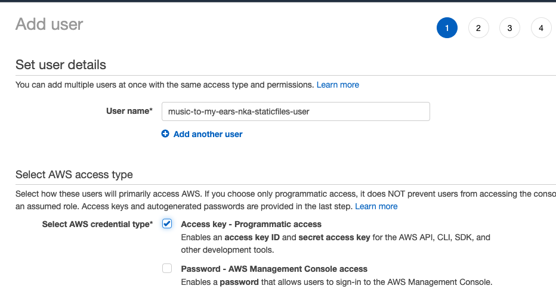

    - Now we have the AWS keys we can paste them in to our Heroku Config Vars. Now in projects settings.py, you'll need to replace the AWS_STORAGE_BUCKET_NAME with your own buckets name.
    - Lastly we need to create a media file in our bucket. Back in your S3 home page, select your bucket, click Create Folder, folder name is media and create. You can now upload images to it.

- ### Setting up Stripe
    - Register with stripe [here](https://stripe.com/gb) if you don't already have an account. Didn't activate account as will be using free tier.
    - In dashboard from main menu and then select developers and then API keys. Here you will get the publishable and secret keys. These shouldn't go into version control so add them as variables in your github environment for development and in Config Vars in Heroku if you are deploying this project. 

        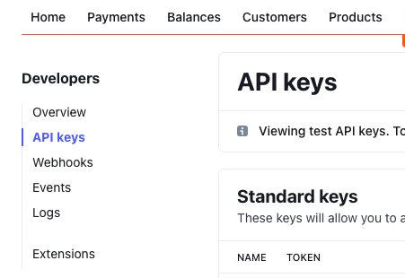

    - We are also using webhooks in this project and so below API keys in the menu there is a Webhooks option, click into it and then select add endpoint.

        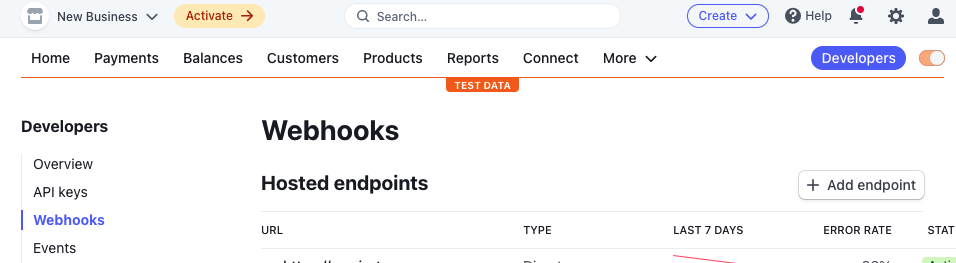
    
    - You'll be asked for a url, this is your github workspace url with /checkout/wh/ added onto the end. When you deploy to Heroko you'll want to create an endpoint for it also, again with the /checkout/wh/ at the end. You then need to select events you want webhooks for. You can select all events but we only really need payment_intent.succeeded and payment_intent.payment_failed. as this is what we have wrote webhandlers for. Select Add Events and then Add Endpoint.

        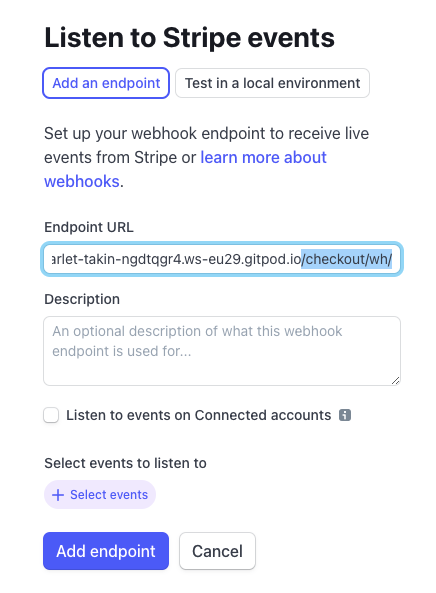
        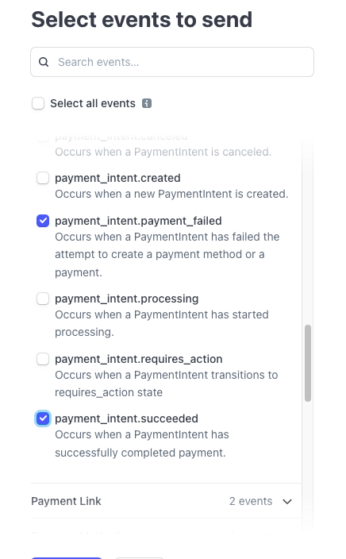

    - Now in your new webhook, reveal Signing secret, copy this and this is the value for the STRIPE_WH_SECRET variable in your github settings. When you make a new endpoint for Heroku you will get a another Signing Secret to use.

        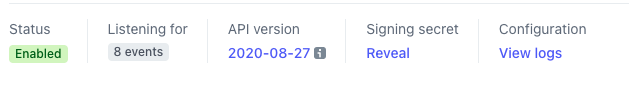

- ### Heroku deployment
    - Log in to Heroku, click 'New' and select 'Create New App'. In window give the app a name and choose region closest to you and then click 'Create App'. Then in Resources under Add-ons, select Heroku Postgres.

       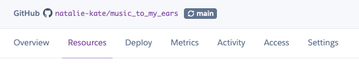
       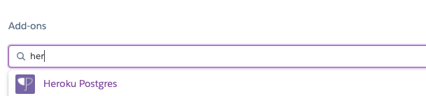

    - In new app page select settings from menu, click reveal config vars and complete the following, see Stripe and AWS sections for where to get their secret key values. DATABASE_URL will have been pre-filled when you selected Postgres. USE_AWS value is True for when we have set up AWS. SECRET_KEY was generated as before with Django Secret Key generator.
      
      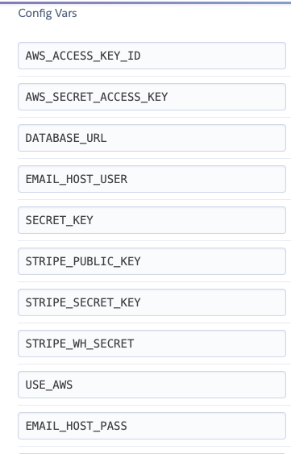

    - Next select 'Deploy' from menu, three options of deployment are available. If you select Heroku Git, it gives you step by step of what you need to do.

      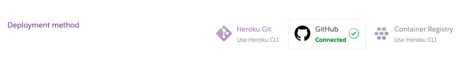

    - I chose to use Github, so you have to search and connect to your github repository. 
    
    - Click enable automatic deployment, below that in manual deploy section, you can pick and deploy a branch to ensure everything is set up correctly. 

      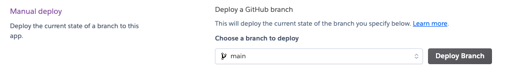
    
    - You will now need to migrate and create superuser as above in Setting Up Project section.

## Credits

### Code

-   Code Institutes walk through project [Boutique Ado](https://github.com/Code-Institute-Solutions/boutique_ado_v1/tree/250e2c2b8e43cccb56b4721cd8a8bd4de6686546)
-   [Bootstrap4](https://getbootstrap.com/docs/4.1/getting-started/introduction/): Bootstrap Library used for the layout and styling and modals.
-   [Alligator](https://alligator.io/css/css-spinning-loader-animation/): Used this articles spinning loader to get my spinning vinyl started.
-   [Coding For Entrepeneurs](https://www.codingforentrepreneurs.com/blog/the-simple-power-of-django-validators): Used for writing my own validator for checking that tracklist had a comma in it, if there is one it indicates that the tracklist has been entered with a comma after every track.
-   [Ruddra on stack overflow](https://stackoverflow.com/questions/67419384/how-to-assign-a-user-to-a-new-object-with-django): Used for when I was having trouble saving user to my contact and events objects.
-   [Hedde van der Heide on stack overflow](https://stackoverflow.com/questions/30799275/in-django-template-how-to-separate-date-and-time-from-datetimefield): Showing only order date in checkout_success and profile templates rather than date and time.
-   [pythontrade](https://stackoverflow.com/questions/64801817/django-allauth-verification-email-send-with-example-comport): My confirmation emails upon user registration said example.com so wanted to change that to my site.
-   [Arpit Solanki](https://stackoverflow.com/questions/45122421/refer-to-admin-site-using-url-admin-in-app-django): Wanted to enable superusers to have admin in nav menu to access admin panel rather than having to put /admin at end of url.
-   [Michael Burrows](https://dev.to/michaelburrows/preview-selected-image-in-a-input-type-file-using-javascript-k5j): Used for showing chosen images prior to form submission.
-   [Atta](https://attacomsian.com/blog/javascript-iterate-filelist): Used to convert files into a list so that I could iterate throught hem to display them in form prior to submission.
-   [Learn About Electronics](http://www.learningaboutelectronics.com/Articles/How-to-retrieve-data-from-a-Django-form-Python.php#:~:text=Basically%20to%20extract%20data%20from,this%20function%20as%20a%20parameter.): To get information out of add events form.
-   [Codegrepper](https://www.codegrepper.com/code-examples/whatever/how+to+keep+all+images+sizes+in+css+card): To ensure all event card images were the same size.
-   [Programiz](https://www.programiz.com/python-programming/keywords-identifier): Helped with Id issues.
-   [Codegrepper](https://www.codegrepper.com/code-examples/javascript/add+the+checked+attribute+to+a+radio+button+DOM+jquery): Adding checked attribute to django form input with javascript.
-   [Stack Overflow](https://stackoverflow.com/questions/13592433/cant-assign-a-value-user-id-to-a-foreignkey-field): Helped me understand what I was doing wrong when trying to assign users to my contact and event objects.
-   [Stack Overflow](https://stackoverflow.com/questions/1235179/simple-way-to-repeat-a-string):Used to get the ratings vinyls to repeat by the number of the index. 
-   [Django Docs](https://docs.djangoproject.com/en/4.0/topics/forms/modelforms/): Helped with radio button CHOICES code for ratings section of contact page.
-   [Juli Colombo](https://medium.com/ibisdev/upload-multiple-images-to-a-model-with-django-fd00d8551a1c): Helped me with dealing with product images. Knew that some products you would want more images than others e.g a special edition or multi disc album. So this article helped me decide to create a seperate image model. 
-   [JQuery docs](https://api.jquery.com/each/): Used in display_image.js to send each file in the array to the displayImg function in turn.
-   [Kaspar Etter](https://stackoverflow.com/questions/19794211/horizontal-scroll-on-overflow-of-table): For enabling my table in order confirmation to scroll horizontally for when table overflows small screens.

### Content

-   Content was created by Natalie Alexander.
    
-   README and TESTING layout and content from my MS1 which took inspirations and ideas from these excellent examples
    * [Code institute](https://github.com/Code-Institute-Solutions/SampleREADME)
    * [Daisy McGirr](https://github.com/Daisy-McG/MilestoneProject-1/blob/master/README.md)
    * [Richard Henyash](https://github.com/richardhenyash/artofnht/blob/darktheme/README.md)
    * [byllsa](https://github.com/byIlsa/Aloy-from-outcast-to-heroine)

### Media
-   Most of the product images were taken of my own collection and a friends who very kindly sent them to me.

-   Some images were from wikipedia as I wanted to showcase more than two genres which seemed to be the majority of the products we had.

-   * [Elviss Railijs Bitāns](https://www.pexels.com/photo/blue-vinyl-record-playing-on-turntable-1389429/): Landing pageimage.
    * [Ena Marinkovic](https://www.pexels.com/photo/acoustic-guitar-with-retro-disks-3721381/): Guitar page header image
    * [Mike](https://www.pexels.com/photo/beige-queen-folder-1181776/): Queen divider header image
    * [Lopsan](https://www.pexels.com/photo/makin-magic-album-sleeve-2191013/)
    * [Dominika Roseclay](https://www.pexels.com/photo/close-up-photography-of-microphone-1032000/): Microphone image on events page
    * [Brett Sayles](https://www.pexels.com/photo/woman-playing-guitar-while-singing-beside-man-playing-bass-guitar-near-microphone-1309240/): Band playing image on events page.
    * [cottonbro](https://www.pexels.com/photo/books-on-brown-wooden-shelf-6862587/): Pile of vinyls used for backup image.
    * [Tuur Tisseghem](https://www.pexels.com/photo/man-playing-saxophone-613813/): Jazz band picture on events page.

 
### Acknowledgements

-   Code Institute for Boutique Ado walk through project. Used the videos a fair bit to get me started.
-   My mentor Spencer Barriball for his time and feedback.
-   My mini feb 2021 team on slack for their feedback and support.
-   Dave Horrocks for getting on the phone with me and helping me figure out my jquery issue. And along with Manny Suzy and Abi for allowing me to join their group. Knowing that they would offer help and recommend resources when I needed them took some of the stress away.
-   The slack community.
-   My partner for taking the lions share of raising our baby and the cooking so that I can study.